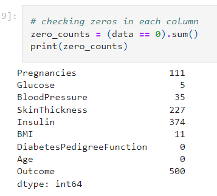

# machine_learning_project-supervised-learning

## Project Overview:

- This dataset is originally from the National Institute of Diabetes and Digestive and Kidney
Diseases. The objective of the dataset is to diagnostically predict whether a patient has diabetes,
based on certain diagnostic measurements included in the dataset. Several constraints were placed
on the selection of these instances from a larger database. In particular, all patients here are females
at least 21 years old of Pima Indian heritage.

- From the data set in the (.csv) File We can find several variables, some of them are independent
(several medical predictor variables) and only one target dependent variable (Outcome).

-	Exploratory data analysis and pre-processing: We will import and clean the data sets, analyze and visualize the relationships between the different variables, handle missing values and outliers, and perform feature engineering as needed.

-	Supervised learning: We will use the Diabetes dataset to build a machine learning model that can predict whether a patient has diabetes or not, using appropriate evaluation metrics such as accuracy, precision, recall, F1-score, and ROC-AUC. We will select at least two models, including one ensemble model, and compare their performance.

## Process

### Exploratory Data Analysis(EDA)

---> In this step I have performed usually EDA steps with the data and I will be mentioning the important findings here for complete steps please refer to:

      https://github.com/pchaudhary12/Supervised-Learning-Diabetes/blob/main/Supervised%20Learning%20-%20Project.ipynb 

---> Checking Zeros on the data

---> Glucose and Bloodpressure has low numbers of zeros and it won't affect the data if we remove it, but for  SkinThickness and Insulin has the highest values as zeros so we won't remove it but will replace it with the mean values of each feature.

---> Zeros for Pregancies and Outcome are meaningfull as they have binary values.

---> Creating Correlation Matrix to check the correlations between features and target variable

---> Checking Distribution of each Independent Variable with histogram

---> our data is not normally distributed.

---> we will create a statistical regression model to check the significant between features(independent variables) and target(dependent) variable

---> As seen some features are not significant with the target variable but we will consider them during Prediction Model and compare the performance with all features and only significant features.

## Preprocessing and Feature Engineering

