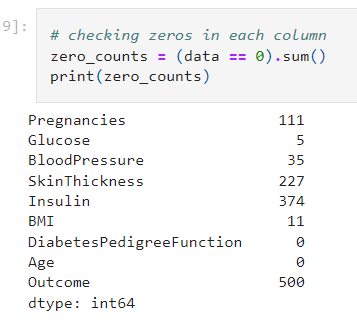
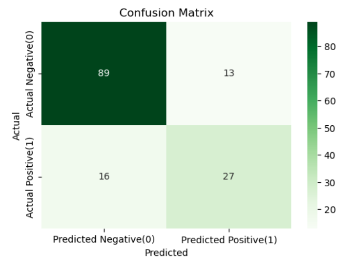
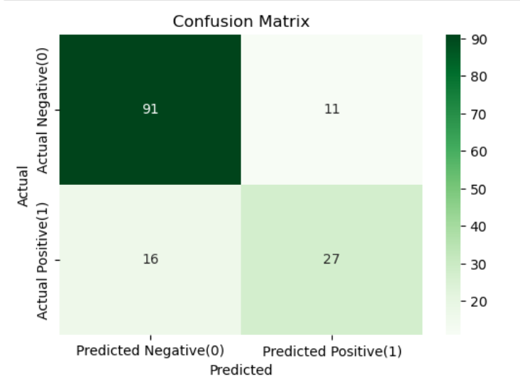
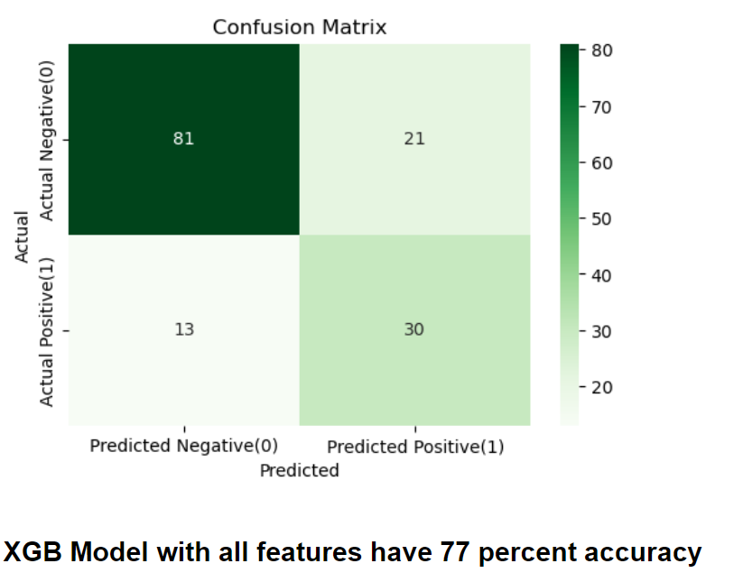
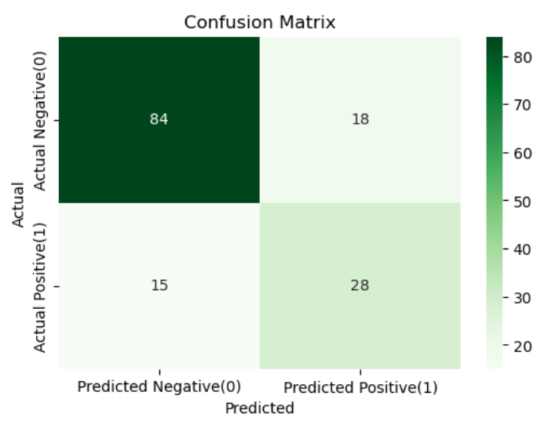
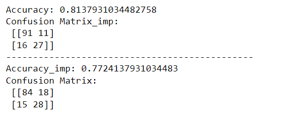

# machine_learning_project-supervised-learning

## Project Overview:

- This dataset is originally from the National Institute of Diabetes and Digestive and Kidney Diseases. The objective of the dataset is to diagnostically predict whether a patient has diabetes,
based on certain diagnostic measurements included in the dataset. Several constraints were placed on the selection of these instances from a larger database. In particular, all patients here are females
at least 21 years old of Pima Indian heritage.

- From the data set in the (.csv) File We can find several variables, some of them are independent
(several medical predictor variables) and only one target dependent variable (Outcome).

-	Exploratory data analysis and pre-processing: We will import and clean the data sets, analyze and visualize the relationships between the different variables, handle missing values and outliers, and perform feature engineering as needed.

-	Supervised learning: We will use the Diabetes dataset to build a machine learning model that can predict whether a patient has diabetes or not, using appropriate evaluation metrics such as accuracy, precision, recall, F1-score, and ROC-AUC. We will select at least two models, including one ensemble model, and compare their performance.

## Process

### Exploratory Data Analysis(EDA)

---> In this step I have performed usually EDA steps with the data and I will be mentioning the important findings here for complete steps please refer to:

      https://github.com/pchaudhary12/Supervised-Learning-Diabetes/blob/main/Supervised%20Learning%20-%20Project.ipynb 

---> Checking Zeros on the data

---> Glucose and Bloodpressure has low numbers of zeros and it won't affect the data if we remove it, but for  SkinThickness and Insulin has the highest values as zeros so we won't remove it but will replace it with the mean values of each feature.

---> Zeros for Pregancies and Outcome are meaningfull as they have binary values.

---> Creating Correlation Matrix to check the correlations between features and target variable

---> Checking Distribution of each Independent Variable with histogram

---> our data is not normally distributed.

## Preprocessing and Feature Engineering

---> In preprocessing we ready the data for Machine learning model and select the features that we need will be usefull for model or create new features that will improve the model performance.

---> First we will take all the features we have in our Data and create model

---> Then we will take only the important features(Clinically Significant features)

---> We will compare models in both the cases and see which performs better

---> We are splitting the data using "train_test_split", in both the cases we will take 80 percent for training and 20 percent for testing.

---> We are scaling our data usin StandardScaler which is a feature scaling technique used to standardize the features of dataset. Scaling features contribute equally to model as the features in our dataset may have different units and scales. It prevents features with larger scales to dominate the model.

---> We are scaling All features and also important features

## Training the Model

### We will create Logistic Model for Classification and XGBoost and compare their performance to see which model performs better:

--> Train the models: Train the selected models on the training set.

--> Model evaluation: Evaluate the trained models on the testing set using appropriate evaluation metrics, such as accuracy, precision, recall, F1-score, and ROC-AUC.

--> Model comparison: Compare the performance of the selected models and choose the best-performing model based on the evaluation metrics.

### Logistic Refression Model:

---> We will create the Logistic Regression model using all features and Significant Features.

---> Train the model on Scaled Training Set and do prediction on Test Set

Interpreting model

First interpreting confusion matrix

confusion_matrix_all_features

confusion_matrix_imp_features

Lets take a look at confusion matrix first as it will give an clear idea for all other Score that we will take Actual Positive and negative are the actually values for the Outcome from our test data.

Prediction values are the values that our model predicted

(1) True Negative: The value model predicted has no diabetes(0) and it was correct

(2) True Positive: The value model predicted has diabetes(1) and it was correct

(3) False Negative: The value that model falsely precticed as no diabetes(0) but actually it was diabetes(1)

(4) False Positive: The value that model falsely precited as diabetes(1) but actually it was no diabetes(0)

For our insight it is really important to get both the No Diabetes(0) and Diabetes(0) correct as Patients needs to be correctly diagnose.

We will take accuracy in consideration

Model with Clinically significant features have better accuracy (81 percent) then Model with all features(80 Percent)

## XGBoost Model

--> We will create XGBoost model with all features and important features and compare their performance

confusion_matrix_all_features

confusion_matrix_imp_features

For XGBoost both the models have 77 percent accuracy

## Comparing the Logistic Regression and XGBoost model

Logistic Regression is performing better than XGBoost but we can't just ignore the XGBoost completely as it might be usefull as well

--> The Model selection depends on the business needs

(1) Interpretability: Logistic Regression models are generally more interpretable than complex models like XGBoost. If model interpretability is a crucial requirement for our application, we might prefer Logistic Regression.

(2) Computational Resources: XGBoost is a more complex and resource-intensive model compared to Logistic Regression. we should consider available computational resources, especially if our plan to deploy the model in a resource-constrained environment.

(3) Scalability: XGBoost is used for large datasets and complex problems. If our data for prodution is usually large and the problem is challenging, XGBoost might be a better choice for scalability and performance.
